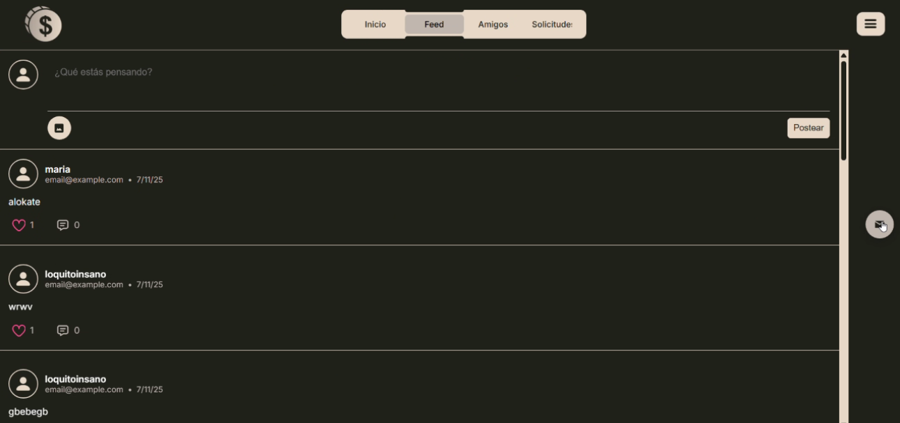
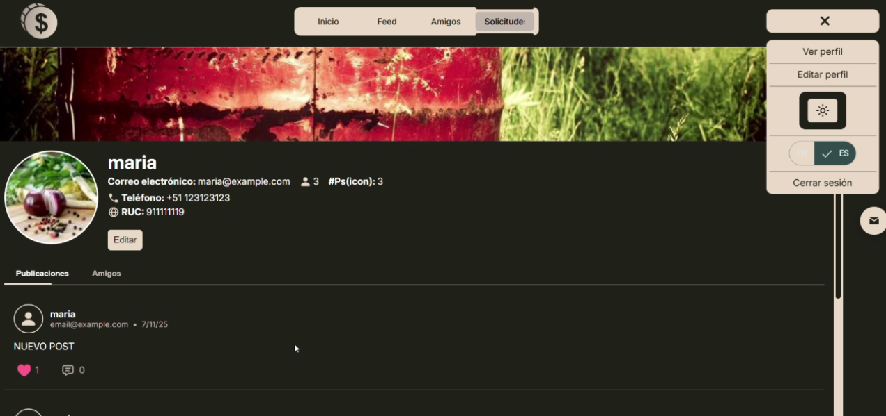

# 🪙 One Coin — Academic Networking Platform

**One Coin** es un proyecto académico desarrollado para el curso de **Sistemas Operativos**, centrado en el despliegue de máquinas virtuales y la práctica del trabajo en equipo con un entorno cliente-servidor.  
La aplicación simula una **red social empresarial**, enfocada en la interacción entre usuarios mediante publicaciones, solicitudes de amistad y mensajería.

---






---

## ⚙️ Funcionalidades principales

- 🔐 Registro e inicio de sesión de usuarios  
- 📝 Creación y visualización de publicaciones  
- 🤝 Sistema de amistades (enviar y aceptar solicitudes)  
- ❤️ Reacciones y comentarios en publicaciones públicas  
- 👤 Visualización de perfiles de usuario  
- 💬 Chat entre usuarios *(funcionalidad aún en mejora)*  
- 🌗 Cambio de tema (modo claro/oscuro)  
- 🌍 Internacionalización **(Español / Inglés)**

---

## 🧠 Rol y aprendizaje

**Rol:**  
Fui responsable de:
- El **diseño y desarrollo completo del frontend** en Angular  
- La **definición de endpoints** y el **flujo de interacción** con el backend  
- La **comunicación con el equipo** (3 integrantes) encargado del backend, base de datos y despliegue  
- La **arquitectura de componentes**, diseño visual y conexión con la API  

**Aprendizajes clave:**
- Arquitectura front-end moderna (Angular)  
- Diseño UI/UX y estructuración de componentes  
- Internacionalización y theming  
- Trabajo colaborativo entre frontend y backend  

---

## 🧩 Tecnologías utilizadas

- **Angular 18+**
- **TypeScript**
- **HTML5 / CSS3**
- **Firebase** *(configuración del proyecto)*
- **JSON Server** *(para pruebas locales)*
- **Git / GitHub**

---

## 🚀 Cómo ejecutar el proyecto
 
```bash
# Instalar dependencias
npm install

# Ejecutar la aplicación en modo desarrollo
ng serve
```
Luego abre 👉 [http://localhost:4200](http://localhost:4200) en tu navegador.

> ⚠️ El backend original ya no está desplegado, por lo que las funcionalidades de red social no están disponibles actualmente.

## 👨‍💻 Autor

Victor Cruz

Estudiante de Ingeniería de Software
